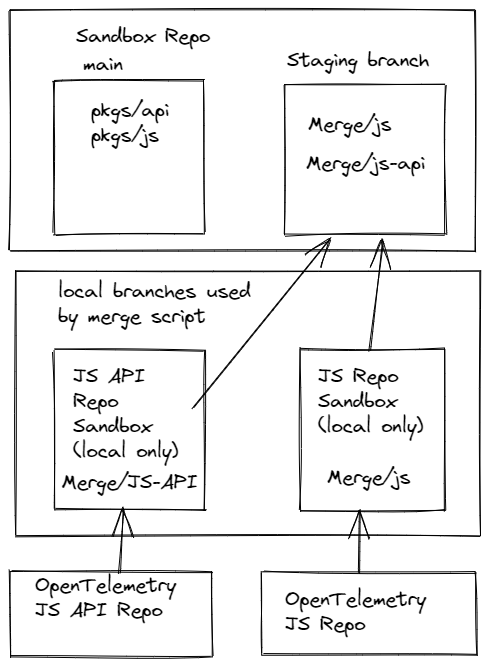

# Auto Merge Tools

This folder contains TypeScript source code that uses the [Simple Git](https://github.com/steveukx/git-js) project to merge the history and tags from original source [OpenTelemetry JS](https://github.com/open-telemetry/opentelemetry-js);  [OpenTelemetry JS API](https://github.com/open-telemetry/opentelemetry-js-api) repositories into the [opentelemetry-sandbox-web-js](../../README.md).

The main Scripts created by TypeScript are

## repoSyncMerge

This script merges the official repository branches into a staging branch so that the complete history from the original repositories is included in this repository.



This script performs the following

- Clone the `opentelemetry/opentelemetry-sandbox-web-js` staging branch `auto-merge/repo-staging` (must exist) into a local temporary folder (removing any previous local folder first)
- Removes any possible "conflicting" files from the root of the merge branch (if present -- only needed for local testing and first run)
- Loops through each configured repository and
  - Creates a local clone of the `source` (js/contrib) repository to be merged (synchronized to the configured `branchStartPoint` (defaults to HEAD))
  - Renames ALL tags to include a configured prefix onto every tags `<repo-prefix>/<original tag>`
  - Moves all of the files for the local clone into a sub folder (`auto-merge/<repo-prefix>`) via `git mv`, so that all of the history is retained
  - Commits the move to the local branch (including the files moved as part of the message) -- as this new "history" will get merged into the `repo-staging`
  - Adds a temporary Remote for the local `source` clone to the `repo-staging` repository.
  - Creates a local branch of the `repo-staging` remote repository (for the current user `<user>/auto-merge-repo-staging`)
  - Fetch, Checkout and sync to the remote repository
  - Removes any untracked local files from this local branch (reset / clean)
  - Merges from the local `source` clone  remote branch into the `<user>/auto-merge-repo-staging` branch using `-X theirs`.
  - Auto Resolves any merge conflicts that could not be auto resolved by selecting `theirs` (for the local `source` branch of the remote repository)
  - Commits the changes into the local `<user>/auto-merge-repo-staging` branch
- At this point the hard work is now complete with the only follow up steps left are
- Iterate over the configured repositories and verifies that the `source` branch contents (all folders / files) match the contents in `<user>/auto-merge-repo-staging`
  - When this does not match (which does occur) it re-copies files that don't match and removes folders that the merge didn't auto remove.
- Perform any final cleanup requested
- Finally perform a `git push -f` to the cloned staging branch to the bot owner(s) fork `<user>/auto-merge-repo-staging` (when running the github action `<user>` is `opentelemetrybot`)
- With the remote branch now on GitHub, it creates a PR to merge the fork branch `<user>/auto-merge-repo-staging` into the sandbox `opentelemetry/opentelemetry-sandbox-web-js` repository `auto-merge/repo-staging` branch.
- It also attempts to push all tags from local `<user>/auto-merge-repo-staging` to Github and the upstream `opentelemetry/opentelemetry-sandbox-web-js` (this may fail if permissions are not available)

## mergeStagingToMain

This script performs all of the heavy lifting by merging / moving the packages from the `auto-merge/repo-staging` branch into the folder structure you see in `main`. As part of this merge / move process it performs the following :-
- Migrates / moves the defined packages from their `source` location (in the `auto-merge/repo-staging` branch) to their new destinations (eg. "auto-merge/js/packages/opentelemetry-core/" => "pkgs/core/")
- As part of the move it updates all relevant and relative paths in the build configurations, all relative source imports are unaffected as the internal structure of the packages are unchanged and packages should not be importing (using relative paths) from other packages.
- It also "renames" all of the package names to include a "sandbox- prefix, so `@opentelemetry/core` becomes `@opentelemetry/sandbox-core` and all imports in all source files and package.json are updated to have their imports include the new `sandbox-` prefixed name.
- Each migrated package is wired up to the build pipeline which is now using rush via the `rush.json`
- Based on the configuration in the `config.ts` it will (by default) enable tests for node, browser and webworker

### How to merge new packages to `main`

To have a new package merged from the `auto-merge/repo-staging` branch to `main` is fairly straight forward and requires minimal changes, the changes required are
- Update the `foldersToMerge` constant in the [`src/config.ts`](./src/config.ts) file to include the new package
  - This array contains an object which defines
    - The expected package `name`, if this does not match the name in the package.json from the `srcPath` location the script aborts
    - The `destPath` identifies where you want the package moved to
    - The `srcPath` identifies where the package is currently located, with the `auto-merge/js` folder being the base for the  `@opentelemetry/opentelemetry-js` repo and `auto-merge/contrib` folder being the base for the `@opentelemetry/opentelemetry-js-contrib`
    - The `bundleName` identifies the prefix name that will be used for the generated browser bundle files (which are created during build time in the `build/bundle` folder). This creates es5/es6 bundles in all supported module types `amd`, `cjs`, `esm`, `iife`, `system` both full and minified.
- Once you update the config you can test locally by running `npm run do-sandbox-staging-merge -- -test -noPr` which will perform the merge process locally in a folder `../.automerge` (back 1 level from your repo root), if you want to run the script again you will need to delete the contents of this folder first.
- Once the script has completed (hopefully successfully) you can validate by changing to the `../.auto-merge/.temp` folder (which is the source repo for the PR that is generated and will be what is updated to `main`). and then just run
  - `npm install`
  - `npm run compile`
  - `npm run test`
- If everything compiles and tests then you PR (to update config.ts) is ready to be submitted so that the `opentelemetrybot` can create the real PR for merging. If you remove the trailing `-noPr` from the running script this WILL create a PR on the main repo with your changes (this is another way to validate the change) and the PR will be prefixed with "[Test]"
- If something doesn't work then
  - If the compile fails, then there will probably need to be a bug fix (to fix the local build break) to JS / JS-Contrib, this generally occurs because the sandbox is using a later version of TypeScript which is more strict
  - If the test fails, then you can disable some of the tests (worker, browser (hopefully not) or webworker (likely)). To fix the test failures (like not running in a web worker) will require fixes in the JS /JS-Contrib repo's and not in `main`

Example of adding the `api-logs` and `api-events`

```typescript
/**
 * Identifies the web packages that should be merged from the staging branch to main and the 
 * location that the package should be moved to.
 */
export const foldersToMerge: IMergePackageDetail[] = [
// ...
    { name: "@opentelemetry/api-logs", destPath: "pkgs/api-logs/", srcPath: "auto-merge/js/experimental/packages/api-logs/", bundleName: "otel-sndbx.api-logs", bundleNamespace: "opentelemetry.sandbox.api-logs", noWorkerTests: true },
    { name: "@opentelemetry/api-events", destPath: "pkgs/api-events/", srcPath: "auto-merge/js/experimental/packages/api-events/", bundleName: "otel-sndbx.api-events", bundleNamespace: "opentelemetry.sandbox.api-events", noWorkerTests: true }
```

The above is the only change required to migrate a new package from the `auto-merge/xxx` folders to be an active compiled package in `main`. On the assumption that the package migrates, compiles and runs all tests.

